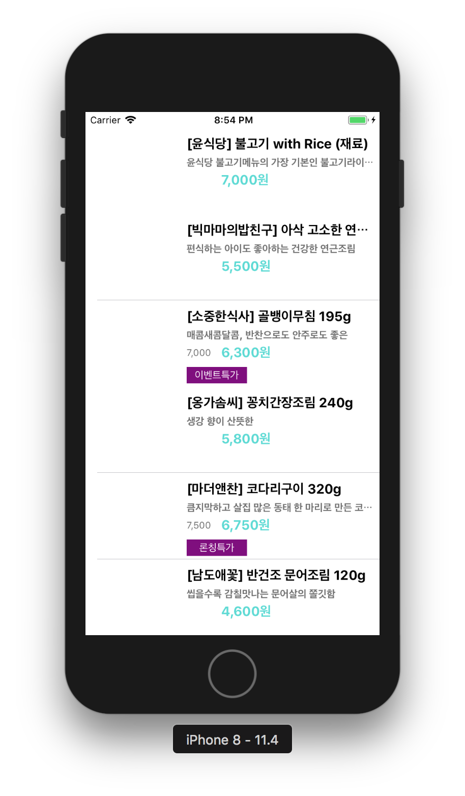

## step1

### 프로그래밍 요구사항
* 스토리보드 ViewController에 TableView를 추가하고 Safe 영역에 가득 채우도록 frame을 설정한다.
* 테이블뷰에 새로운 프로토타입 Cell을 추가하고, Custom 스타일로 지정하고 다음과 같이 디자인한다.
* main.json 데이터 경로 => `http://public.codesquad.kr/jk/storeapp/main.json`

* 위 파일을 다운로드해서 프로젝트에 복사하고 JSONDecoder를 활용해서 내부에 Array<StoreItem> 타입으로 변환하는 DataSource에서 사용할 모델 객체를 만든다.

	* subscript로 배열에 index로 접근하면 StoreItem 구조체를 반환한다.
	* StoreItem은 Decodable 프로토콜을 채택하고, main.json에 있는 키와 값을 매핑해서 속성으로 갖도록 구현한다.
* UITableViewDataSource 프로토콜 구현 부분에서 cell을 위에서 만든 DataSource 모델 객체에 접근해서 테이블뷰를 표시한다.

	* 이미지뷰에 image는 아직 표시하지 않는다.




### 학습꺼리
* Swift 객체에 대한 Encoding & Decoding 방식에 대해 학습한다. [공식 자료](https://developer.apple.com/documentation/foundation/archives_and_serialization/encoding_and_decoding_custom_types)


## step2

### 프로그래밍 요구사항
* 스토리보드 ViewController에 Cell을 Content View를 기준으로 하위 뷰들에 오토레이아웃을 적용한다.
	* 메뉴 이미지 뷰는 top, bottom, lead 제약을 주고 width 제약을 넣는다. height와 width 비율은 1:1로 aspectRatio를 맞춘다.
	* 타이틀 제목은 메뉴 이미지보다 10pt 우측에 lead 제약을 주고, top, tail 제약을 주고, height 제약을 준다.
	* 상세 설명도 top 제약만 타이틀 제목보다 4pt 띄우고, 나머지는 타이틀에 맞춘다.
	* 메뉴 가격도 width 제약을 넣고, 나머지는 타이틀과 마찬가지로 제약을 준다.
	* 이벤트 배지는 최소width 제약만 주고 글자 내용에 맞추고, 없을 경우 감춘다.

### 목표 실행 화면
* 모든 아이폰 사이즈에 대응해서 잘리는 화면이 없이 나와야 한다.


### 학습꺼리
[오토레이아웃 강의 자료](http://public.codesquad.kr/jk/storeapp-layout-slide.pdf)


## step3

### 프로그래밍 요구사항
* 다음 2개 파일을 다운로드해서 프로젝트에 복사하고 JSONDecoder를 활용해서 모델 객체를 기존 main과 함께 섹션(section)을 구분할 수 있도록 개선한다.
* 스토리보드 ViewController에 Cell에 Section Header로 사용할 Custom Cell을 추가한다.
	* 총 섹션은 3개로 구분해서 헤더에 다음과 같이 표시한다.
	* main => `메인반찬 / 한그릇 뚝딱 메인 요리`
	* soup => `국.찌게 / 김이 모락모락 국.찌게`
	* side => `밑반찬 / 언제 먹어도 든든한 밑반찬`

	


## step4

### 요구사항

* 패키지 의존성 관리 도구에 대해 학습하고 적용한다.
	* Cocoapods에 대해 학습한다 [공식 홈페이지](https://cocoapods.org/)

### 프로그래밍 요구사항
* Cocoapod 를 설치한다. [설치 가이드](https://guides.cocoapods.org/using/getting-started.html#getting-started)
`https://github.com/devxoul/Toaster` 저장소에 있는 Toaster 패키지를 cocoapod 으로 설치한다.
pod으로 설치한 Toaster 모듈을 import 하고 테이블뷰 셀을 터치하면 (didSelect) 타이틀 메뉴와 (할인된)최종 가격 정보를 toast 형태로 표시한다.


### 학습꺼리
* 다른 패키지 매니저 도구가 어떤게 있는지 학습하고 비교해서 정리한다.

```
• CocoaPods - Cocoa projects의 의존하고 5만개가 넘는 
라이브러리와 300만개가 넘는 응용프로그램이 사용된다. 
CocoaPods는 프로젝트를 확장하는데 도움을 준다

• SwiftLint - swift style guide를 기반으로 스타일과 
규칙을 적용하는 도구 

• Carthage - Cocoa 응용프로그램에 프레임워크를 간단히 
추가할 수 있는 도구 

• Homebrew - macOS 운영 체제의 소프트웨어 설치를 단순하게 만들어준다
```


* 프로젝트 설정과 관련된 용어에 대해 학습하고 정리한다.

```
• Workspace – 하나 이상의 프로젝트(들)로 이루어지며, 
보통 이 프로젝트들은 서로 연관이 있다.
• Project – 코드와 리소스 등을 갖고 있다.
• Target – 각 프로젝트는 하나 이상의 타겟을 갖고 있다.
	￮ 각 타겟은 프로젝트의 빌드 설정을 정의한다.
	￮ 각 타겟은 또한 빌드 시 포함하거나 사용할 클래스, 
	리소스, 커스텀 스크립트들을 정의한다.
	￮ 타겟은 보통 같은 프로젝트의 서로 다른 배포본을 위해 사용한다.
		▪︎ 예를 들어 내 프로젝트는 두 개의 타겟을 갖고 있는데, 
		“보통”의 빌드가 하나 있고 별도의 테스트 기능들, 몇 개의 
		배경음악, 배경음악을 변경하는 버튼을 갖는 “회사” 빌드가 있다
		 (유료 / 무료 버전을 각각 정의할 때도 사용할 수 있다).
		▪︎ (프로젝트에) 클래스나 리소스를 추가할 때, 어느 타겟에 
		포함시킬지도 결정한다.
		▪︎ 어떤 클래스/리소스가 어떤 타겟에 포함될지 선택할 수 있다.
			▪︎ 예를 들어 “회사” 빌드에는 “DebugHandler” 
			클래스가 포함된다.
		▪︎ 테스트(TDD)를 추가할 경우, 이것 역시 새로운 타겟을 
		추가 시킨다.
• Scheme – “Build”, “Test”, “Profile” 등을 수행할 때 
어떤 동작을 할지 정의한다.
	￮ 보통 각 타겟은 하나 이상의 스킴을 갖는다.
	￮ Scheme > Manage Schemes 에서 “Autocreate 
	Schemes Now”를 선택해서 타겟의 스킴을 자동 생성할 수 있다.
	￮ An Xcode scheme defines a collection of targets 
	to build, a configuration to use when building, 
	and a collection of tests to execute. 
	(스킴은 빌드할 타겟들의 집합, 빌드할 때 사용할 설정, 
	수행할 테스트들의 집합을 정의한다.
```

#### 참고링크
[iOS: Workspace, Project, Target, Scheme](http://suho.berlin/engineering/ios/ios-workspace-project-target-scheme/)